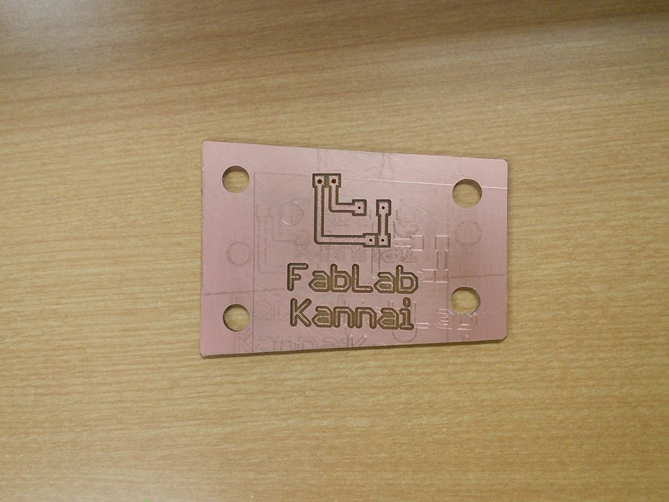
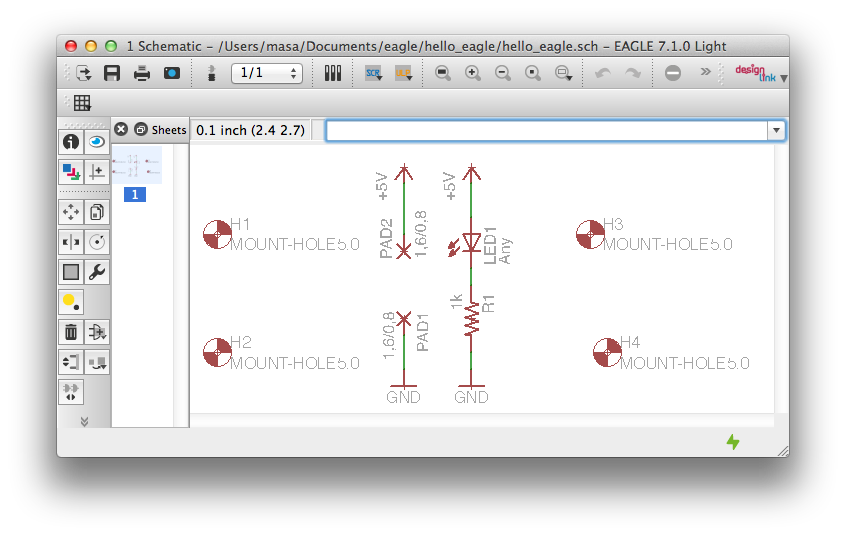
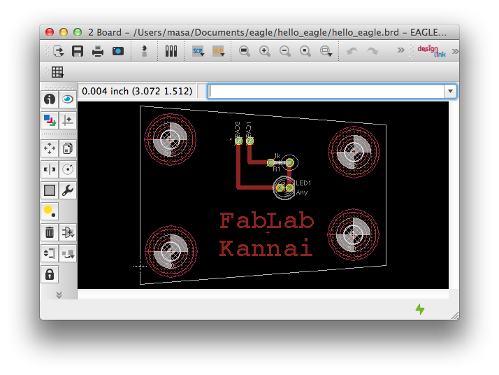

# Hello Eagle
Make your first led circuit with Eagle 

## Prerequisite
 OS:Mac  
 
## Install 
Install Eagle
http://www.cadsoftusa.com/download-eagle/

## Make a schematic  

 Control-Click eagle folder in Projects on Control Panel  
 Select New Project on the context menu  
 Name your project name  
 Control-Click on your project  
 Select New > Schematic  
 Click Add Button   
 Select LED5MM from led > LED  
 Click OK  
 Click once on drawing area  
 Click Stop Button  
 Select R-US_0414/5V from regsistor library  
 Click OK and click drawing area  
 Select GND twice from supply 1 and put it on the area.  
 Select +5V twice from supply 1 and put it on the area.  
 Select WIREPAD1,6/0,8 twice from wirepad and put it on the area.  
 Select MOUNT=HOLES5.0 4 times from holes an put it on the area.  
 Place them as you want   
 Select Wire Button and connect them by  clicking to draw and double-clicking for finishing  
 Click Generate/Swicth To Board Button   
## Make a board

 Put elements within the area  
 Select AutoRoute Button and Click Continue.. Button  
 Click End Job Button   
 Click Info Button and Click red line on the draweing area  
 Change Width to 0.04  
 Click Grid  
 Change the size to 0.04  
 Select On from Display section  
 Click Rect 
 Click on drawing area to draw 0.08x0.08 Rect.   
 Move them to PAD positions to make it easy to solder.   

 Save  
## Export Garber Data 
Click excellon.cam from CAM Jobs on Control Panel
Select File > Open > Board > your board file(.brd) saved above.  
Click Process Job  
Click x button  
Click gerb274x[2L].cam  (or any you want) 
Select File > Open > BOard > your board file(.brd) saved above.
Click Process Job

### (Option) Garber File Format: Replace \n with \r\n  
If your export files need to be used on Windows  
I do just like following:  
brew install unix2dos  
cd [your project folder]  
ls | grep [your project name] | xargs unix2dos  
od -c [a your file name]  for checking there is \r in your file.  
 
## c.f.
* gerb274x[2L].com http://www.p-ban.com/gerber/eagle.html  

